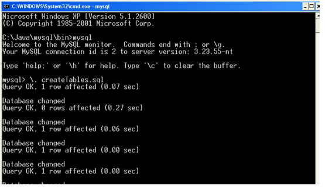

## Accessing Compact Discs Table with Python Script Exercise

In this exercise, you will write a Python script to access and manipulate the `compact_discs` table in the existing MySQL database. 

Follow the steps below to complete the exercise.

### Prerequisites

Before starting the exercise, ensure that you have the following:

- Python installed on your machine
- The mysql-connector-python package installed

### Step 0: Setting up the Database

The following instructions involve the command prompt. You can also use MySQL Workbench if you prefer. The script is located here:  labs\mysql\createTables.sql.

1.	MySQL should be installed and running on your machine. The script for creating the Compact Disc tables can be found in <LAB_HOME>labs\mysql \createTables.sql, so launch a command prompt in this folder.

2.	Type ```mysql  –u root -p``` and press enter.

3.	Enter the database password, which if you are using the course VM, will be ```c0nygre```.

4.	To run the script, enter ```\. createTables.sql```. See Figure 1. Note that the path might be different depending upon where you created the command prompt.



5.	To confirm the tables have been created, in the console, type select * from compact_discs; to see the listing, and then select * from tracks; to see the second listing.


### Step 1: Setting Up the Project

1. Create a new folder on your machine for the exercise.
2. Open a text editor (e.g., Notepad, Visual Studio Code).
3. Create a new Python script file with a `.py` extension (e.g., `access_compact_discs.py`).

### Step 2: Importing Required Modules

1. At the beginning of the script, import the necessary modules:
   ```python
   import mysql.connector
   ```

### Step 3: Connecting to the MySQL Database

1. In the script, establish a connection to the MySQL database:
   ```python
   db = mysql.connector.connect(
       host="localhost",
       user="root",
       password="c0nygre",
       database="conygre"
   )
   ```

### Step 4: Retrieving Compact Discs

1. Execute a SELECT query to retrieve all compact discs from the `compact_discs` table:
   ```python
   query = "SELECT * FROM compact_discs"

   cursor = db.cursor()
   cursor.execute(query)

   result = cursor.fetchall()
   ```
   This retrieves all records from the `compact_discs` table and stores them in the `result` variable.

2. Print the retrieved compact discs:
   ```python
   print("Retrieved Compact Discs:")
   for cd in result:
       print(cd)
   ```

### Step 5: Testing the Retrieval

1. Run the script to test the retrieval functionality.
2. Ensure that the compact discs are printed correctly.

### Step 6: Updating a Compact Disc

1. Execute an UPDATE query to modify a specific compact disc in the `compact_discs` table:
   ```python
   query = "UPDATE compact_discs SET title = 'New Title' WHERE id = 10"

   cursor = db.cursor()
   cursor.execute(query)
   db.commit()
   ```
   This updates the `title` column of the compact disc with `id` equal to 10.

### Step 7: Testing the Update

1. Run the script to test the update functionality.
2. Retrieve the compact disc with `id` equal to 10.
3. Verify that the title has been updated to 'New Title'.

### Step 8: Deleting a Compact Disc

1. Execute a DELETE query to remove a specific compact disc from the `compact_discs` table:
   ```python
   query = "DELETE FROM compact_discs WHERE id = 10"

   cursor = db.cursor()
   cursor.execute(query)
   db.commit()
   ```
   This deletes the compact disc with `id` equal to 10 from the table.

### Step 9: Testing the Deletion

1. Run the script to test the delete functionality.
2. Attempt to retrieve the compact disc with `id` equal to 10.
3. Verify that no record is returned.

### Step 10: Inserting a New Compact Disc

1. Execute an INSERT query to add a new compact disc to the `compact_discs` table:

```python
   query = "INSERT INTO compact_discs (title, artist, price, tracks) VALUES ('New Disc', 'New Artist', 12.99, 10)"

   cursor = db.cursor()
   cursor.execute(query)
   db.commit()
   ```

This inserts a new record into the table.

### Step 11: Testing the Insertion

1. Run the script to test the insert functionality.
2. Retrieve all the compact discs .
3. Verify that the inserted record is returned.

