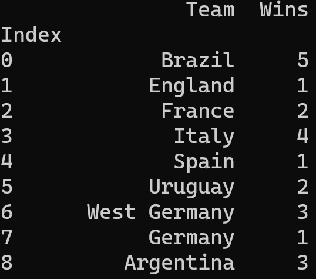
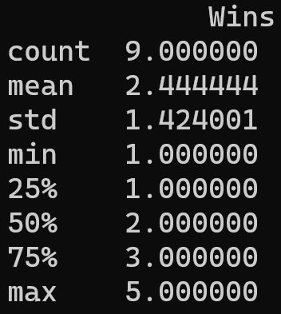
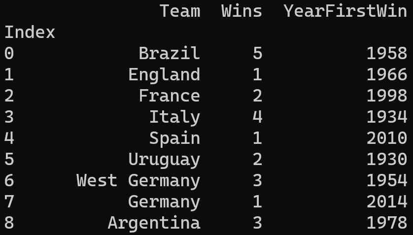
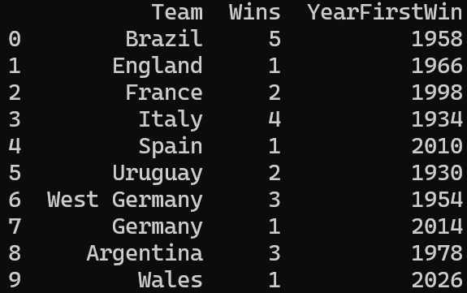

# Getting Started with Pandas

## Overview

In this lab you'll create a simple Pandas DataFrame containing
information about FIFA World Cup winners since the tournament started in
1930. You'll use various techniques to manipulate the rows and columns
in the DataFrame.

## Source folders

Student folder : C:\\AdvPythonDev\\Student\\11-PandasGettingStarted

Solution folder: C:\\AdvPythonDev\\Solutions\\11-PandasGettingStarted

## Roadmap

There are 7 exercises in this lab, of which the last two exercises are
\"if time permits\". Here is a brief summary of the tasks you will
perform in each exercise; more detailed instructions follow later:

1.  Creating a Pandas DataFrame

2.  Saving and loading a DataFrame (with index and column headers)

3.  Saving and loading a DataFrame (without index and column headers)

4.  Obtaining info about a DataFrame

5.  Adding a column to a DataFrame

6.  (If time permits) Adding a row to a DataFrame

7.  (If time permits) Additional suggestions

##  Exercise 1: Creating a Pandas DataFrame

In the *student* folder, create a new file named
processWorldCupWinners.py in a text editor. Add code to create a new
DataFrame from scratch, containing two columns of data:

- Team - The name of a country that has won the FIFA World Cup

- Wins - The number of times that country has won the FIFA World Cup

You can get the information you need from here:

> <https://en.wikipedia.org/wiki/List_of_FIFA_World_Cup_finals>

Print the DataFrame on the console. It should look something like this:

> {width="1.9300459317585301in"
> height="1.8195144356955382in"}

Notice two interesting points here:

- The DataFrame has an "integral range" index -- this is the default
  type of index if you don't specify an index explicitly. It's important
  to understand that every Pandas DataFrame (or Series) has an index,
  whether you create the index yourself or whether Pandas creates it for
  you.

- The index doesn't have a name. That's OK, but generally you'll find it
  handy to give the index a name so you can refer to it when
  manipulating the DataFrame later. You can assign a name to the index
  as follows:

> df.index.name = \'Index\'
>
> Print the DataFrame after specifying the index name, and you should
> see the index now has a name 😊.
>
> {width="1.8863429571303587in"
> height="1.6619466316710412in"}

**\
Exercise 2: Saving and loading a DataFrame (with index and column
headers)**

In this exercise you'll save the DataFrame to a CSV file and/or Excel
spreadsheet, and then load it back in again. You'll use the following
functions to save the data (here, we assume df is the name of your
DataFrame object):

> df.to_csv(filename, index=True/False, header=True/False)
>
> df.to_excel(filename, index=True/False, header=True/False)

The index parameter indicates whether you want to write the index column
to the file. Set this flag to True, so that the CSV file and/or Excel
spreadsheet will have a column containing the index value for all the
rows.

The header parameter indicates whether you want to write the names of
the columns to the file. Set this flag to True as well, so that the
first line in the CSV file or Excel spreadsheet will indicate the names
of the columns. This makes the data more meaningful for anyone using it.

Run your code and verify the CSV file and/or Excel spreadsheet have been
created, with index values and column names as expected.

Now add code to read data back in from the CSV file and/or Excel
spreadsheet. Use the following functions:

> new_df = pd.read_csv(filename,
>
> index_col=\'Index\',
>
> header=0)
>
> new_df = pd.read_excel(filename,
>
> index_col=\'Index\',
>
> header=0)

The index_col parameter tells Pandas that the column named \'Index\' in
the CSV file or Excel spreadsheet isn't any old column, it's the *index*
column, which is special.

The header parameter tells Pandas that row 0 in the file contains column
names, rather than real data. Therefore, Pandas will read row 0 and use
the information therein to deduce the names of the columns for the
DataFrame.

After you've read the DataFrame back in from the CSV file and/or Excel
spreadsheet, print it on the console and verify it's all still intact.

**\
Exercise 3: Saving and loading a DataFrame (without index and column
headers)**

This exercise is a variation of the previous one. Tweak your calls to
write the CSV file and/or Excel spreadsheet as follows:

> df.to_csv(filename, index=False, header=False)
>
> df.to_excel(filename, index=False, header=False)

Note the index parameter is False now, so the index values won't be
written to the CSV file or Excel spreadsheet. You could argue this is
the "correct" approach in this scenario, because the index values are
pretty meaningless in our data.

Also note the header parameter is False too, so the column names won't
be written to the CSV file or Excel spreadsheet. This is also quite
common in data science -- the idea being that you're meant to know the
meaning of each field anyway, without the need for explicit column
names.

Run your code and verify the CSV file and/or Excel spreadsheet have been
created, without index values or column names.

Now add code to read data back in from the CSV file and/or Excel
spreadsheet. Use the following functions:

> new_df = pd.read_csv(filename, names=\[\'Team\', \'Wins\'\])
>
> new_df.index.name = \'Index\'
>
> new_df = pd.read_excel(filename, names=\[\'Team\', \'Wins\'\])
>
> new_df.index.name = \'Index\'

Note the names parameter. This tells Pandas what names to use for the
(anonymous) columns that it reads in from the file.

Also note the statement that explicitly reinstates the name of the index
column. Pandas will generate new index values as it reads in every row
from the file. We tell Pandas the name to use for the index column.

After you've read the DataFrame back in from the CSV file and/or Excel
spreadsheet, print it on the console and verify it's all fine.

**\
Exercise 4: Obtaining info about a DataFrame**

Print the following information for your DataFrame:

- Info about the index for the DataFrame. You can get this via the index
  property. You should find that the index is a RangeIndex with a start
  value of 1, a stop value of 9, and a step of 1. This is the default
  index generated by Pandas, because your dataset doesn't really contain
  any meaningful index values.

- The Team column. This should be a Series object, where the index is
  the same as above, and the data type is object (it's a string
  actually, but Pandas just treats it as a vanilla object).

- The Wins column. This should be another Series object, where the index
  is the same as above, and the data type is int64.

You can also get summary information about the whole DataFrame via the
describe() function. This function returns a string of useful info, so
print it on the console. It should look something like this:

> {width="1.6298097112860892in"
> height="1.8196445756780402in"}

describe() returns the following statistical information for each
numeric column in the DataFrame, which can be very helpful in giving you
some initial insights into the spread of values:

- Row count

- Average (mean) value

- Standard deviation

- Minimum value

- 25^th^ percentile

- 50^th^ percentile

- 75^th^ percentile

- Maximum value

**Exercise 5: Adding a column to a DataFrame**

When you create a DataFrame object, it's a mutable data structure. You
can modify any data cells, add new rows or columns, delete rows or
columns, etc.

Currently your DataFrame object has two columns (plus an index). Each
column is a Series object, which contains all the values for that
column:

- Team column -- Series object containing the team names

- Wins column -- Series object containing the number of times teams have
  won the cup

In this exercise you'll add a third column named YearFirstWin, which
will contain the year a country first won the World Cup. For example,
Brazil first won the World Cup in 1958; they beat Wales in the
quarter-finals, Pele got the winner midway through the 2^nd^ half, not
that I'm bitter....

Anyway, back to the Python. To add a column named YearFirstWin to your
DataFrame, follow these steps:

- Create a Series object, and populate it with the correct year for when
  that country first won the World Cup (you can see the correct values
  below).

- Insert the Series object into your DataFrame object. This is just like
  inserting an item into a Python dictionary, i.e. aDict\[key\] = value.

After you've done this, print the DataFrame again. Each row should now
have 3 columns:

> {width="3.8800568678915135in"
> height="2.2085772090988627in"}

**Exercise 6 (If time permits): Adding a row to a DataFrame**

Add a row to your DataFrame, to hold the likely winners of the 2026
World Cup in North America. I think it's gonna be Wales. You can create
a new row as follows:

> new_row = {\'Team\': \'Wales\', \'Wins\': 1, \'YearFirstWin\': 2026}

Then add the new row to the DataFrame as follows:

> df = pd.concat(\[df, pd.DataFrame(\[new_row\])\],
>
> ignore_index=True)

Note that concat() doesn't modify the original DataFrame object.
Instead, it creates and returns a new DataFrame with the new row. You
must reassign this to your DataFrame variable.

Print the DataFrame when you're done, and verify Wales will actually do
this business.

> {width="3.845834426946632in"
> height="2.4145155293088365in"}

**Exercise 7 (If time permits): Additional suggestions**

Print the following selective rows from the DataFrame:

- One-time winners of the World Cup

- Multiple winners of the World Cup

- Teams that first won the World Cup during this millennium

- Teams that have won the World Cup 2 or 3 times

- Just the *names* of teams that have won the World Cup 2 or 3 times
