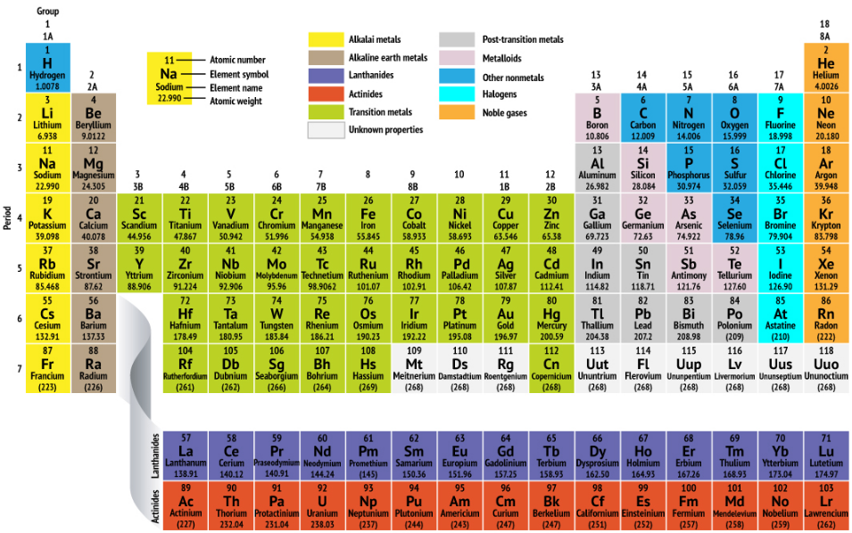

# RDD Operations

# Part One

## Overview

In this lab you\'ll use various RDD transformation methods to manipulate
data from several simple text files.

## Source folders

- labs/rddoperations1 (student folder)

- solutions/rddoperations1 (solutions folder)

## Roadmap

There are 3 exercises in this lab, of which the last exercise is \"if
time permits\". Here is a brief summary of the tasks you will perform in
each exercise; more detailed instructions follow later:

1.  Mapping and filtering data

2.  Performing set-based operations

3.  (If Time Permits) Additional transformation suggestions

##  Exercise 1: Mapping and filtering data

In this exercise you will perform various mapping and filtering
operations on RDD objects. You will do all your work in app1.py, so open
this file in the text editor now. The application makes use of data from
two text files:

- klm.txt -- contains a partial list of airports that KLM flies into.

- norwegian.txt -- contains a partial list of airports that Norwegian
  Airlines flies into.

Follow the comments in app1.py to complete this exercise. After each
step, save the Python file and run it locally with python app1.py.

## Exercise 2: Performing set-based operations

In this exercise you will perform set-based operations on RDD objects.
You will do all your work in app2.py, so open this file in the text
editor now. The application makes use of data from two text files:

- teams.txt -- contains the names of Premier League teams, 2017-18

- stadiums.txt -- contains the stadiums of Premier League teams, 2017-18

Follow the comments in app2.py to complete this exercise. After each
step, save the Python file and run it locally with python app2.py to test your new
code. Here are some additional hints:

- To zip teams with stadiums, use the zip() method. You should obtain a
  collection of tuples such as (Arsenal, The Emirates), (Bournemouth,
  Vitality Stadium), etc.

- To get the Cartesian product of all teams, call the cartesian() method
  on the teams RDD. Also pass the teams RDD as a parameter, so that you
  perform a Cartesian product between all the teams. You should obtain a
  collection of tuples such as (Arsenal, Arsenal), (Arsenal,
  Bournemouth), (Arsenal, Burnley), etc.

- To get all the fixtures, it\'s similar to getting a Cartesian product
  but you need to filter-out the tuples where element \[0\] equals
  element \[1\]. E.g. tuples such as (Arsenal, Arsenal) should be
  excluded from the result.

##  Exercise 3 (If time permits): Additional transformation suggestions 

In this exercise you\'ll perform various transformation operations on
data for some chemical elements in the periodic table. The data is
located in elements.txt. For each element, we\'ve specified the
following information (we\'ve used tabs as field separators):

- Atomic number

- Atomic mass

- Group number in the periodic table

- Period number in the periodic table

- Symbol

- Name of element

The following graphic shows how these pieces of information relate to
each other:

{width="6.5in" height="4.0625in"}

We\'ve defined a Python class named Element in element.py, to represent
an element in the periodic table. All the code you have to write will be
in app3.py, so open this file in the text editor now. Complete the
application as per the comments in app3.py. Run it locally with python app3.py.
