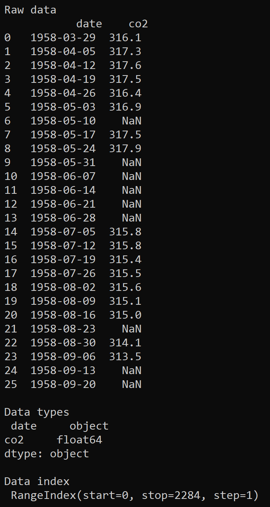
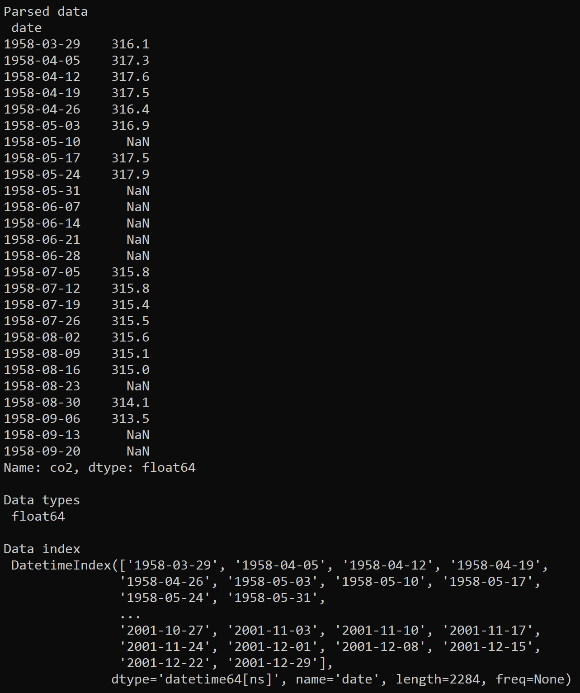
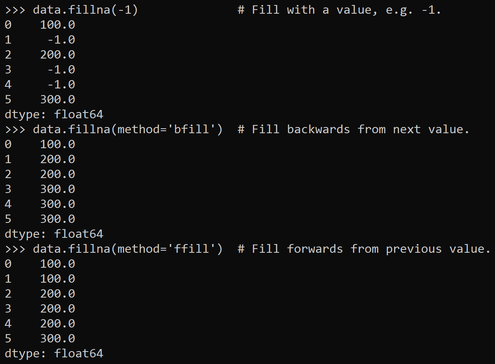
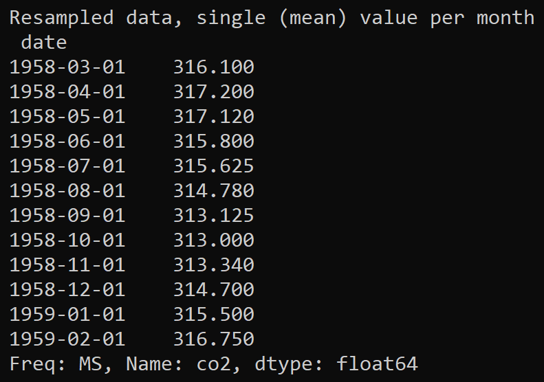
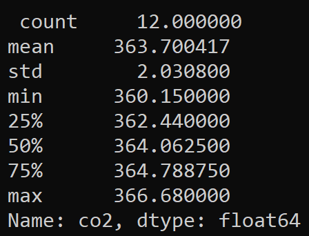
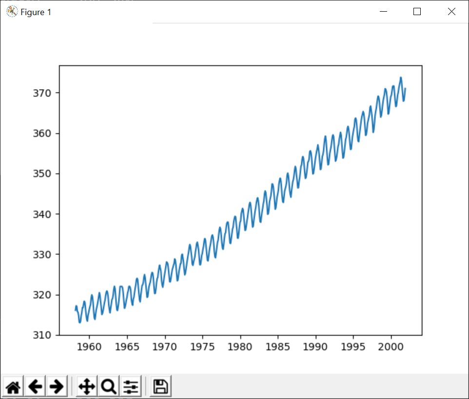
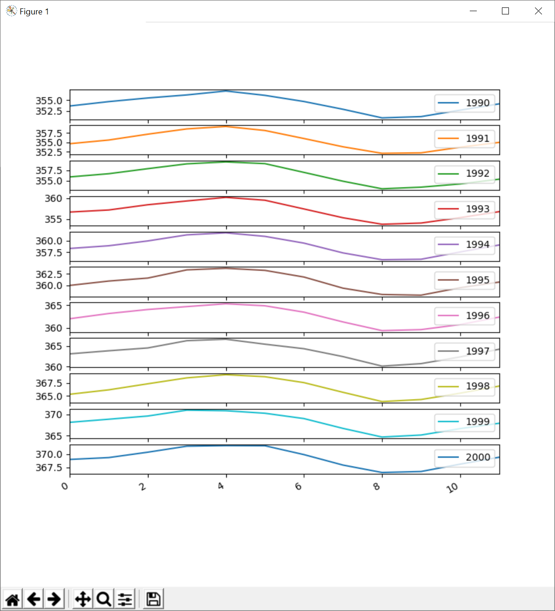
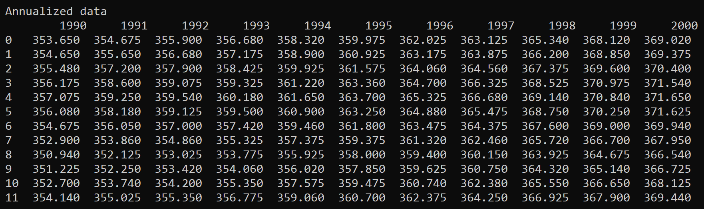
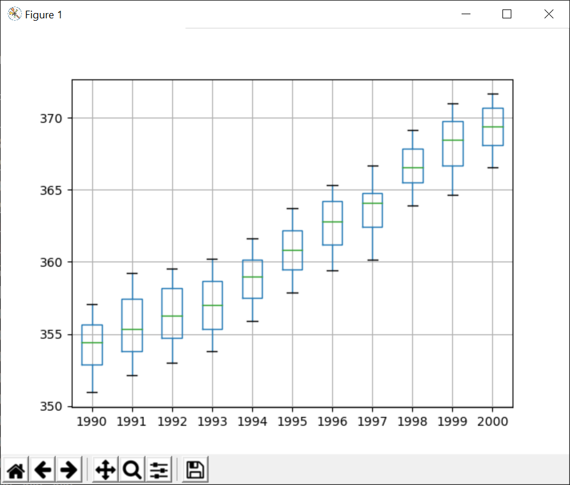

# Working with Time Series Data

## Overview

In this lab you'll load time series data from a CSV file, manipulate the
data using various Pandas functions, and plot the data using various
MatPlotLib plotting functions.

## Source folders

Student folder : C:\\AdvPythonDev\\Student\\13-TimeSeries

Solution folder: C:\\AdvPythonDev\\Solutions\\13-TimeSeries

## Roadmap

There are 7 exercises in this lab, of which the last exercise is \"if
time permits\". Here is a brief summary of the tasks you will perform in
each exercise; more detailed instructions follow later:

1.  Loading raw time series data

2.  Loading time series data and indexing by date

3.  Filling in holes in time series data

4.  Resampling time series data

5.  Indexing into time series data

6.  Plotting time series data

7.  (If time permits) Additional plotting techniques

##  Familiarization

In the *student* folder, open CO2.csv in a text editor. This file
contains real measurements of atmospheric CO~2~ concentrations taken at
Mauna Loa Observatory in Hawaii between 1958 and 2001.

This is how the data in the CSV file was collated:

- Physicists recorded CO~2~ concentrations four times per hour. Steady
  data periods of at least 6 hours per day were required; if there was
  no such 6-hour period on any given day, then no data was recorded for
  that day.

- Weekly averages were calculated for most weeks during the period from
  1958 to 2001. There were some weeks where no averages would be
  calculated because no data had been collected.

Now take a closer look at the data in the CSV file. Each line in the
file has two columns:

- The date column contains weekly dates.

- The co2 column contains the average CO~2~ value for that week. Some
  weeks don't have a value. We'll need to think about how to handle
  these weeks when we start working with the data shortly...

**\
Exercise 1: Loading raw time series data**

In the student file, open processCO2data.py in a text editor. Note we've
included a couple of Python import statements to get you started.

Add code to load the data from CO2.csv into a Pandas DataFrame, and
print the following info about the DataFrame:

- The first 26 weeks of data (i.e. 6 months) -- use the head() function
  here.

- The data types of the columns in the DataFrame -- use the dtypes
  property here.

- The index values in the DataFrame -- use the index property here.

You should see information such as the following displayed.

> {width="3.2847222222222223in"
> height="6.155885826771653in"}

**Exercise 2:** **Loading time series data and indexing by date**

In the previous exercise you loaded the CSV data into a simple Pandas
DataFrame. The DataFrame was indexed by number (e.g. 0, 1, 2, etc.).

When working with time series data in Python, it's important that the
DataFrame is indexed by *date/time* rather than by *number*. Therefore,
tweak your call to the read_csv() function so that it specifies the date
column as the index column for the DataFrame.

Also extract the co2 column of the DataFrame object into a Pandas Series
object (it's easier to manipulate time series data in a Series than to
grab a column from a DataFrame).

Print the following information about the Series object:

- The first 26 weeks of data.

- The data type of the Series.

- The index values the Series.

This should confirm that the Series is now indexed by date/time rather
than by number:

> {width="4.590277777777778in"
> height="5.483786089238845in"}

**Exercise 3: Filling in holes in time series data**

As you've seen, some of the weekly recordings of CO~2~ data are empty --
these show up as NaN when you print the data.

Dealing with missing data can be an important consideration when
processing time series data, and Pandas provides a handy function named
fillna() that fills in holes in a DataFrame or Series object. See here
for full documentation:

> <https://pandas.pydata.org/pandas-docs/stable/reference/api/pandas.Series.fillna.html>

Let's see how the fillna() function works. Open a new Python shell (i.e.
type python at the command line) and type the following statements to
import the Pandas and Numpy modules and to create a Pandas Series object
that contains some holes:

> import pandas as pd
>
> import numpy as np
>
> data = pd.Series(\[100, np.nan, 200, np.nan, np.nan, 300\])

Now call the fillna() function with various parameters as follows, to
fill-in the holes in various ways (note that by default, fillna()
doesn't modify the data in-place; rather, it leaves the original data
unchanged and returns new data with the holes filled in):

> data.fillna(-1) \# Fill with a value, e.g. -1.
>
> data.fillna(method=\'bfill\') \# Fill backwards from next value.
>
> data.fillna(method=\'ffill\') \# Fill forwards from previous value.

You should see the following output. Note how the holes at index 1, 3,
and 4 are filled in:

> {width="4.694444444444445in"
> height="3.450618985126859in"}

Now that you know how fillna() works, tweak your code in
processCO2data.py so that it fills in the holes in the CO~2~ time series
data. We suggest you use either the \'bfill\' or \'ffill\' method (in
the solution code, we've plumped for the \'bfill\' method).

Remember to reassigned the updated data back to your original variable.
For example, if your data variable is named ts, then you need code such
as the follows:

> ts = ts.fillna(method=\'bfill\')

Print the time series data after you've filled in the holes, to verify
that all the entries in the time series data now contain actual values
(i.e. no NaN values anywhere).

**\
Exercise 4: Resampling time series data**

When you're working with real-world time series data, one of the
challenges you might encounter is that you have too much data. For
example, imagine an avionics sensor that captures data every millisecond
-- one day's worth of data will include 86,400,000 data points!

It's highly likely you don't need that much data for your statistical
calculations. Indeed, having to deal with such vast datasets can be
untenable unless you throw some serious hardware at the problem, or use
a product such as Apache Spark and Hadoop for Big Data computing.

In many cases, the best approach is to "resample" the data to reduce the
number of data points. This is such a common technique that Pandas
provides a function named resample() that resamples data in a DataFrame
or Series object. See here for full documentation:

<https://pandas.pydata.org/pandas-docs/stable/reference/api/pandas.Series.resample.html>

resample() performs a "group by" operation. You can pass a string
parameter that indicates how to group values (e.g. \'MS\' means group by
the start of a calendar month). For a list of all the possibilities, see
here:

<https://pandas.pydata.org/pandas-docs/stable/user_guide/timeseries.html#dateoffset-objects>

resample() returns a "resampler" object that represents the resampled
data, e.g. the data grouped by the start of calendar months. You can
then call various functions to calculate things like the maximum/minimum
value in each group, the mean value in each group, the variance or
standard deviation in each group, and so on. For a full list of
functions available, see here:

<https://pandas.pydata.org/pandas-docs/stable/reference/resampling.html>

Putting all this together, add the following statement in
processCO2data.py. The statement resamples the data into calendar-months
groups and calculates the mean value for each month.

> ts = ts.resample(\'MS\').mean()

Print ts after this operation, to confirm that you now have monthly data
(rather than weekly data as before). For example, the first 12 values
should look like this:

> {width="3.3541666666666665in"
> height="2.357669510061242in"}

**Exercise 5: Indexing into time series data**

As we discussed during the chapter, when you work with time series data
in Python/Pandas, the DataFrame or Series object must be indexed by
date/time. This means you can index into the data to obtain the value
for a particular date/time, or get a range of values for a specified
date/time range.

With this in mind, add code in processCO2data.py to obtain the CO~2~
readings for the following dates or date ranges:

- CO~2~ reading for July 1958

- CO~2~ readings for July-December 1958

- CO~2~ readings for all months up to December 1958

- CO~2~ readings for all months from July 1997 onwards

- CO~2~ readings for all months in 1997

You can also get statistical summary information for values in a
date/time range, via the describe() function. For example, get
statistical information for all CO~2~ readings in 1997. You should see
the following results:

> {width="2.319688320209974in"
> height="1.7708333333333333in"}

**Exercise 6: Plotting time series data**

Visualization is a valuable tool when you're trying to understand time
series data. You can use MatPlotLib to plot various types of graphs that
show how the data varies over time. To get started, add the following
code in processCO2data.py to plot all the time series data:

> plt.plot(ts)
>
> plt.show()

The graph should look like this:

> {width="5.343514873140857in"
> height="4.549008092738408in"}

**Exercise 7 (If time permits): Additional plotting techniques**

Another common requirement is to compare data for different seasons,
side-by-side, to help you understand common patterns. For example, the
following graphs show how CO~2~ values vary during each year in the
decade 1990 - 2000 (we explain how to generate this graph on the
following page):

{width="6.501388888888889in"
height="7.166666666666667in"}

Let's see how to generate the graphs shown on the previous page. The
first step is to get a slice of the time series data, for the period
1990 -- 2000:

> tsSlice = ts\[\'1990\' : \'2000\'\]

Next, group the values into annual chunks (the idea is to create a
DataFrame with a separate column for each year's worth of data). Here's
the code you need, followed by an explanation:

> groups = tsSlice.groupby(pd.Grouper(level=\'date\', freq=\'Y\'))
>
> annualizedData = pd.DataFrame()
>
> for dateIndex, group in groups:
>
> annualizedData\[dateIndex.year\] = group.values
>
> print(\'\\nAnnualized data\\n\', annualizedData)

The first statement uses the groupby() function to group data into
annual groups. The groupby() function takes a Pandas Grouper object as a
parameter, which specifies that we want to group entries by the date
index column, with 12 entries in each group (i.e. 12 months in each
group).

The groupby() function returns a "groupby" object that contains a
collection of groups. We iterate through the collection of groups and
copy each group of values into a separate column in the DataFrame. The
columns are named by year.

This is what the DataFrame looks like when we print it:

{width="6.5in" height="1.9375in"}

The final step is to plot the DataFrame as a bunch of subplots:

> annualizedData.plot(subplots=True, legend=True)
>
> plt.show()

There are other types of plots available. For example, the following
code will print the DataFrame as a boxplot:

> annualizedData.boxplot()
>
> plt.show()

Here's what the boxplot looks like:

> {width="4.902777777777778in"
> height="4.17380249343832in"}

Each "box and whiskers" conveys 5 pieces of information:

- The minimum value (the bottom of the lower whisker)

- The maximum value (the top of the upper whisker)

- The 25^th^ percentile (the bottom of the box)

- The 75^th^ percentile (the top of the box)

- The mean (the line within the box)
